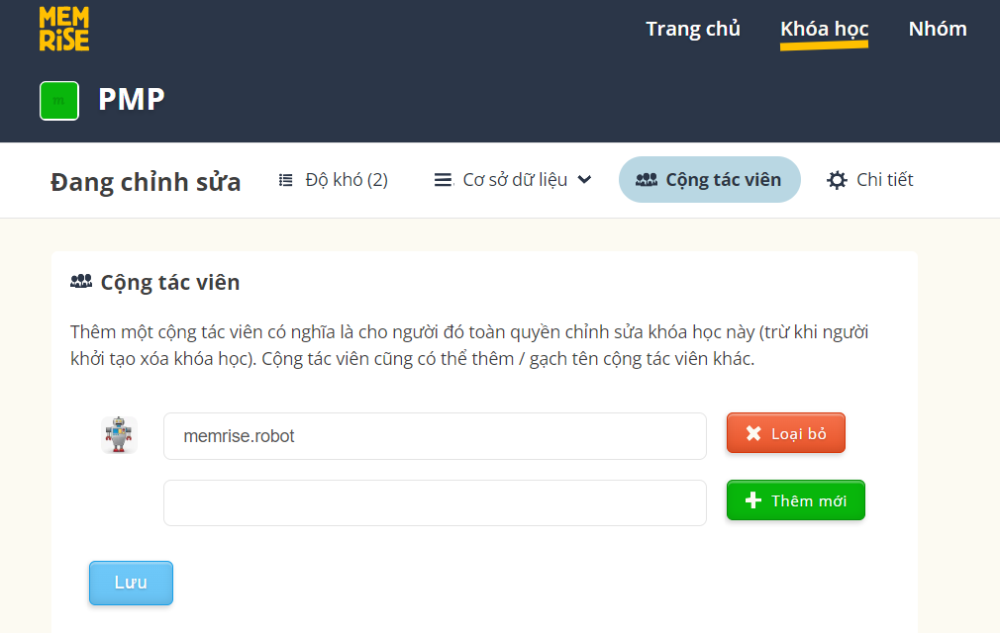
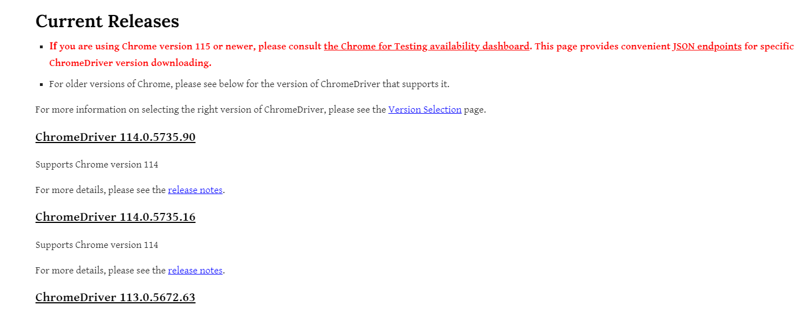

# MemriseRobot

MemriseRobot là một chương trình python giúp bổ sung **audio** và **pronunciation** cho các khóa học từ vựng trên Memrise.

## 1. Hướng dẫn sử dụng

Bước 1: Thêm người dùng **memrise.robot** là cộng tác viên của khóa học. 

Bước 2: Tải và cài đặt chương trình.

Tải chương trình:
***
git clone https://github.com/hieubkset/MemriseRobot.git
***

Cài đặt các thư viện phụ thuộc:
***
pip install requirements.txt
***

Bước 3: Tải chương trình chromedriver

_Từ phiên bản selenium v4.6.0 không cần tải đã tích hợp sẵn chromedriver, do đó nếu dùng selenium >= 4.6.0 không cần thực hiện bước này._

Truy cập trang web https://chromedriver.chromium.org/downloads, tải **ChromeDriver** phiên bản mới nhất tương ứng với hệ điều hành. 

Sau đó, lưu **ChromeDriver** vào thư mục trong dự án. Cụ thể:
+ chrome/linux: cho hệ điều hành linux
+ chrome/macos: cho hệ điều hành macos
+ chrome/windows: cho hệ điều hành windows

Bước 4: 

1. Verify chromeddriver file is same version with your chrome browser

2. Select appropriate language code, for example: ko-KR (Korean), en-US (American English)
